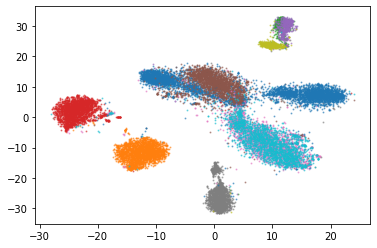

# LSHVec: A Vector Representation of DNA Sequences Using Locality Sensitive Hashing

## Summary

This is a reimplementation of [LSHVec (FastText version)](https://github.com/Lizhen0909/LSHVec).

LSHVec is a k-mer/sequence embedding/classfication software which extends [FastText](https://fasttext.cc/) . It applies LSH (Locality Sensitive Hashing) to reduce the size of k-mer vocabulary and improve the performance of embedding.

Besides building from source code, LSHVec can run using docker or singularity.

Please refer to [A Vector Representation of DNA Sequences Using Locality Sensitive Hashing](https://www.biorxiv.org/content/10.1101/726729v1) for the idea and experiments.

There are also some pretained models that can be used, please see [PyLSHvec](https://github.com/Lizhen0909/PyLSHvec/blob/master/README.md) for details.


## Installation


First clone the code

```
    git clone https://github.com/bochen0909/lshvec-upcxx.git
    cd lshvec-upcxx
```


### OpenMP Version

This the mult-thread version, which is built default.

#### Requirements

1. Linux, GCC with C++14
2. openmp, zlib

#### Build
```
    mkdir build && cd build
    cmake ..
    make
```

### UPCXX Version

(still working in progress......)

#### Requirements

1. Linux, GCC with C++14
2. openmp, zlib
3. mpi > 2.0
4. UPCXX > 202003

Checkout (upcxx website)[https://bitbucket.org/berkeleylab/upcxx/wiki/Home] for more details about upcxx

#### Build
```
    mkdir  build && cd build
    cmake -DBUILD_LSHVEC_UPCXX=ON ..
    make
```

## Examples

A practical example which uses ActinoMock Nanopore data can be found at [Tutorial_ActinoMock_Nanopore.ipynb](notebook/Tutorial_ActinoMock_Nanopore.ipynb). The notebook ran on a 16-core 64G-mem node and took a few hours (I think 32G mem should work too).



## Usage

### rphash 

create a hash function.

```
    $ rphash -h

    rphash v0.1.0
    Usage: rphash [options] 
    Allowed options:
        -h, --help
            shows this help message
        -i, --input
            input fasta file
        -o, --output
            output file path (default 'rp.bin')
        --fasta
            input are fasta files
        --fastq
            input are fastq files
        -k, --kmer-size
            size of kmer
        --hash-size
            number of bits of hash
        --thread
            thread to use (default 0)
```

### train 

train a model

```
    $ train -h
    
    train v0.1.0
    Usage: train [options] file1, file2 ....
    Allowed options:
        -h, --help
            shows this help message
        -z, --zip
            zip output files
        --use-skipgram
            use skipgram (ohterwise cbow)
        --fasta
            input are fasta files
        --fastq
            input are fastq files
        -o, --output
            output model prefix (default 'model')
        --hash-file
            hash file to use
        --lr
            initial learning rate (default 0.3)
        --dim
            number of dimension (default 300)
        --half-window
            half window size (default 5)
        --neg-size
            negative words size (default 5)
        --epoch
            number of epochs to train (default 100)
        --thread
            thread to use (default 0)
```

### transform 

transform sequences to vectors

```
    $ transform -h
    
   transform v0.1.0
    Usage: transform [options] file1, file2 ....
    Allowed options:
        -h, --help
            shows this help message
        -z, --zip
            zip output files
        --fasta
            input are fasta files
        --fastq
            input are fastq files
        -o, --output
            output file (default out.txt)
        --vec
            vector file (binary) path
        --hash-file
            hash file to use
        --thread
            thread to use (default 0)

```


## Compare to FastText version

* Pure c++, less dependence
* Use C++ instead of python to make hash function
* Hash codes of kmers are computed during training. (FastText version needs to save hashed kmers in file which requires big space.)
* Initialize fast. (FastText version builds dictionary before training which takes long time before training)
* Use openmp instead of thread.


## License

GNU v3 License